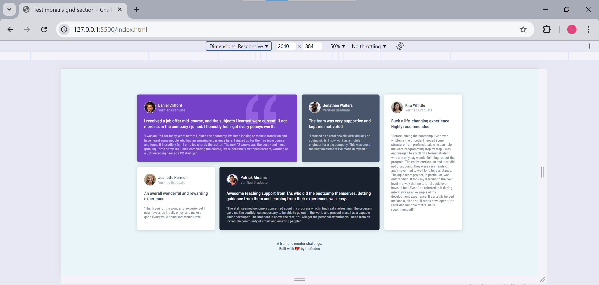

# Frontend Mentor - Testimonials grid section solution

This is a solution to the [Testimonials grid section challenge on Frontend Mentor](https://www.frontendmentor.io/challenges/testimonials-grid-section-Nnw6J7Un7). Frontend Mentor challenges help you improve your coding skills by building realistic projects. 

## Table of contents

- [Overview](#overview)
  - [The challenge](#the-challenge)
  - [Screenshot](#screenshot)
  - [Links](#links)
- [My process](#my-process)
  - [Built with](#built-with)
  - [What I learned](#what-i-learned)
  - [Continued development](#continued-development)
  - [Useful resources](#useful-resources)
- [Author](#author)
- [Acknowledgments](#acknowledgments)


## Overview

### Screenshot




### Links

- Solution URL: [Github repo to the code for the challenge](https://github.com/AllisonFavour/fm-challenge7)
- Live Site URL: [Vercel link to view the challenge](https://fm-challenge6.vercel.app/)

## My process

Started with structuring my HTML with the end styling in mind which i have come to understand is a key process. Before coding it out, i try to take my time while carefully observing the figma design or in this the design preview image because i am using the free version of frontend mentor.

After carefully taking note of the design layout i go ahead to write out the HTML structure with accessibility in mind.
Considering HTML semantic in mind, i started out with main tag as the parent element which is the child element to body. the main tag houses a section which holds a div with the class name of .cards and footer.
The .cards container holds all the card elements which i used article for each card. In each .card there is two child elements which are header and a div with the class name of .content.
The header element contains an image and a div with the class name of .name-status which also has two child elements of span with each class name of .name and .status.
The .content container holds two element as well which are h1 tag with the class name of .title and p tag with the class name of .description.
Then finally for the footer we have two p tags.

For the styling, i made use of the SASS tool which additional features helped make my code easier to write and understand.
I started with creating a component folder that has four files namely:
_resets.scss - this file contain styles for css reset
_variables.scss - this file contains variables for colors and font
_cards.scss - this file holds all the stylings for the .cards and .card and its respective child elements
_footer.scss - this file contains the style for footer

I added some comments to each files also aid with code readability

### Built with

- Semantic HTML5 markup
- CSS custom properties and Flexbox and Grid


### What I learned

I learnt the power of grid and how it helps in responsiveness and layout of elements on the webpage.
Making use of the grid properties to achieve my desired styling, the css code below helped me achieve the complex layout of the individual testimonial card.
```css
.cards {
    /* other codes to handle width, height, border, padding etc if needed. */
    display: grid;
    grid-template-columns: repeat(4, 1fr); /* 4 columns */
    grid-template-rows: repeat(2, auto); /* 2 rows */
    gap: 20px; /* Optional, for spacing between items */
    align-items: stretch;
}

  .item1 {
    grid-column: span 2; /* Item 1 spans 2 columns */
    grid-row: 1; /* Item 1 is in the top row */
  }

  .item2 {
    grid-column: span 1; /* Item 2 spans 1 column */
    grid-row: 1; /* Item 2 is in the top row */
  }

  .item3 {
    grid-column: span 1; /* Item 3 spans 1 column */
    grid-row: 2; /* Item 3 is in the bottom row */
  }

  .item4 {
    grid-column: span 2; /* Item 4 spans 2 columns */
    grid-row: 2; /* Item 4 is in the bottom row */
  }

  .item5 {
    grid-column: span 1; /* Item 5 spans 1 column */
    grid-row: span 2; /* Item 5 spans 2 rows */
  }
```

Making use of SASS directives like 
@import - used for importing css components
@mixins - used for creating like list of styling variable
@include - used for applying the list of styles created with mixins

I used media queries for handling some screen breakpoints to ensure responsiveness across various browser or phone screen sizes 


### Continued development

Ensure its responsiveness to a variety of screens


## Author

- Website - [Allison Favour](https://allison-favour-portfolio-darkmode.vercel.app/)
- Frontend Mentor - [@AllisonFavour](https://www.frontendmentor.io/profile/AllisonFavour)
- Twitter - [@TrillestOjay](https://x.com/TrillestOjay)


## Acknowledgments

Thanks to my resilience for being able to start and finish this project and thanks for frontend mentor for providing such a wonderful learning platform.